This year, thanks to Universidad Carlos III de Madrid, I had the pleasure to attend the
[`using std::cpp`](https://eventos.uc3m.es/141471/programme/using-std-cpp-2026.html) 2026 conference, where renowned 
professors and engineers &ndash; including Bjarne Stroustrup himself &ndash; gave talks on various topics and projects, 
all with the common denominator of C++.

The event lasted for three days in total, with a fourth one devoted entirely to workshops which I was not able to 
attend due to my schedule. Nonetheless, it was a very thought-provoking experience in which I have learned a lot on
the state-of-the-art C++ features and applications.

This is meant to be a summary of the program; I will briefly discuss the lectures I found most interesting, as
well as some other aspects worth pointing out. Before proceeding, however, I would like to show my gratitude
to Professor José Daniel García Sánchez for allowing selected students to attend the event, and to everyone behind it.

<figure style="float: right; margin: 0.5rem 0 1rem 2rem; text-align: center; max-width: 20%;">
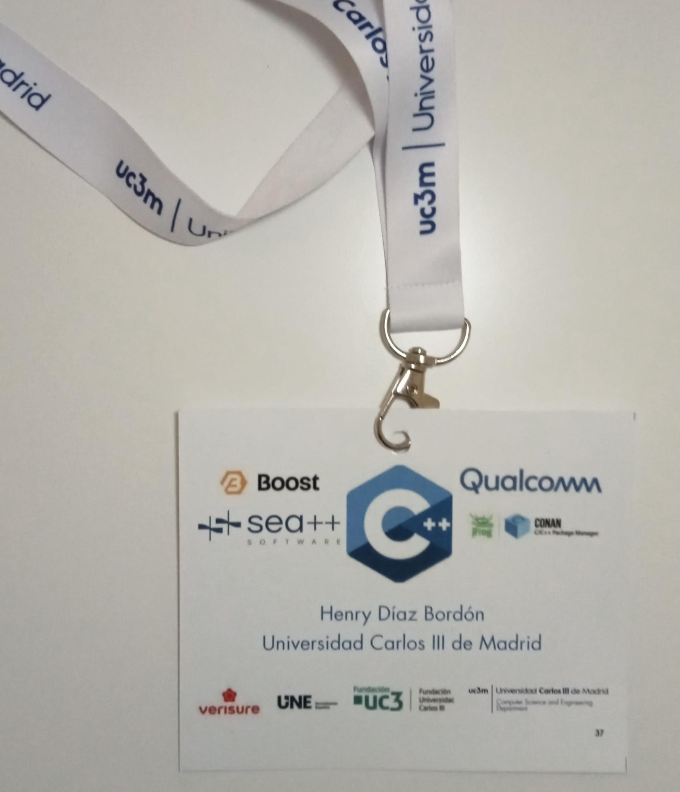
<figcaption>My conference pass.</figcaption>
</figure>

# First day

People started gathering at around 9 AM; we all received our tags and then went to the auditorium, where at 9:30 the
conference opening took place. The vice-rector for Research and Transfer of the university Luis Enrique García Muñoz, 
together with the head of the Polytechnic School César Huete Ruiz de Lira, and the aforementioned José Daniel García 
Sánchez all gave a warm welcome to the guests, and mentioned some of the key parts of the event in the span of half an 
hour, and then it truly began.

The first talk was delivered by Jeff Garland, member of the ISO C++ committee, contributor to the Boost libraries, and
well known for being the co-founder of the Beman project. It was titled "C++29 Library Preview: A Practitioner's Guide",
and as strange as it may seem to talk about C++29 when C++26 is not finished (at the time this is published), it was
actually a very sensible lecture, since it focused mainly on features that did not make it to C++26 mostly due to the
lack of time, and that will probably be available in the next C++ standard. Personally, I did not understand every single
one that was listed therein, since there is a wide range of them that I do not use on a daily basis, but it was very
interesting to see improvements in memory safety, string processing, numerics, views, and even [scnlib](https://www.scnlib.dev/),
the `scanf` counterpart to `libfmt`. There was not enough to delve into every single change in detail, but what was
explained looked promising.

<figure style="text-align: center;">
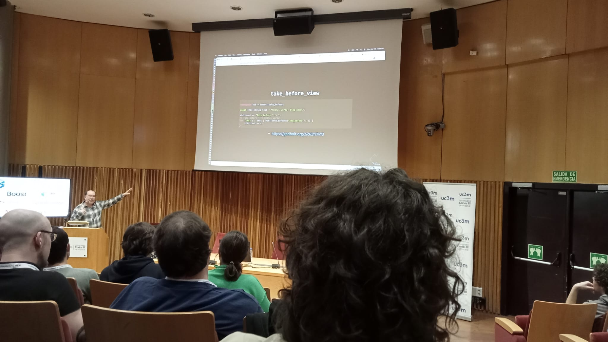
<figcaption>Mr. Garland explaining the new `take_before_view`.</figcaption>
</figure>

I had classes from 11:00 to 13:00, so I was not able to attend the next two lectures, which is especially 
unfortunate for "High frequency trading optimizations at Pinely", by Mikhail Matrosov, as it was the one I was looking
forward to the most. Regardless, I was still able to participate in three more.

The next one, after lunch, was "Don't be negative!", by Frances Buontempo. It focused on the various ways to
perform a simple task: removing negative numbers from a container. It started very simply, by just applying 
`std::erase_if` to a vector of numbers, but it got progressively more abstract and powerful through the use of
templates and concepts, in which case we can consider the `0` as the empty instantiation of the type; overall, the
code was of this form at some point:
```c++
template <typename T>
concept Numeric = std::integral<T> || std::floating_point<T>;

template <typename Container>
requires Numeric<typename Container::value_type>
void remove_negatives(Container& c)
{
    std::erase_if(c, [](const auto& value) {
        return value < 0;
    });
}
```

However, as a side note, one of the viewers spotted the fact that, the `Numeric` concept defined above does not exclude 
`bool`s, so it is still not perfect.

<figure style="text-align: center;">
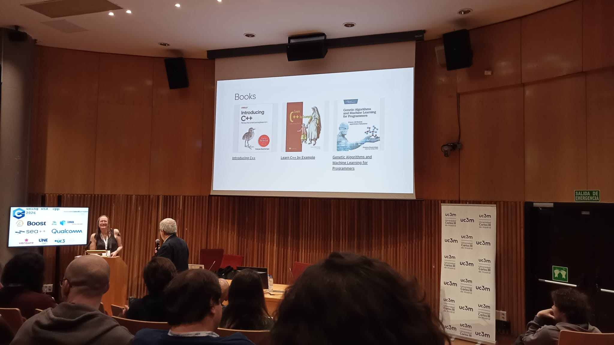
<figcaption>Books published by Frances Buontempo.</figcaption>
</figure>

Before I proceed with the third of the talks I attended, I stopped at a [Conan](https://conan.io/) booth that was located
right next to the _Salón de Grados_. I was not aware of the existence of that tool, and it was very pleasing to see a
good-looking C++ package manager. I must say, however, that I have not tried it personally, and thus I cannot give a
consistent opinion on the quality of the product. The demo they presented was very appealing, cross-compiling a CUDA
application to an Nvidia Jetson Orin and showcasing very good speed and many quality-of-life features. They also gave
t-shirts and a (J)frog, since they were sponsors of the event, and the very next talk elaborated on the previous example.

<figure style="float: left; margin: 0.5rem 2rem 1rem 0; text-align: center; max-width: 20%;">

<figcaption>T-shirt and JFrog frog.</figcaption>
</figure>

Titled "Cross-Platform C++ AI Development with Conan, CMake, and CUDA", Luis Caro's talk was a practical, demo-driven
walkthrough showing how Conan and modern CMake can be used to tame the complexity of packaging and cross-building
GPU-accelerated projects. The demo wrapped components (CUDA runtime, cuDNN and the `llama.cpp` build) into a small
Conan recipe and used a target-specific Conan profile to express the cross toolchain (architecture, compiler, libc,
compiler flags). With `conan install --profile <target>` the session generated a CMake toolchain and dependency files
so CMake could transparently pick the cross-compiler and link against Conan-provided targets. Some takeaways from the 
talk were:

* One can use Conan lockfiles and versioned recipes to ensure reproducible binaries across developer machines and CI.
* QEMU actually is not ideal in this case, since this code is not a "pure" ARM binary, hence cross-compiling is the
  right choice.

In the first demo they compiled `llama.cpp` with CUDA, and ran a small test. In the second part, they focused on 
cross-compiling a demo app to the Jetson.

<figure style="text-align: center;">
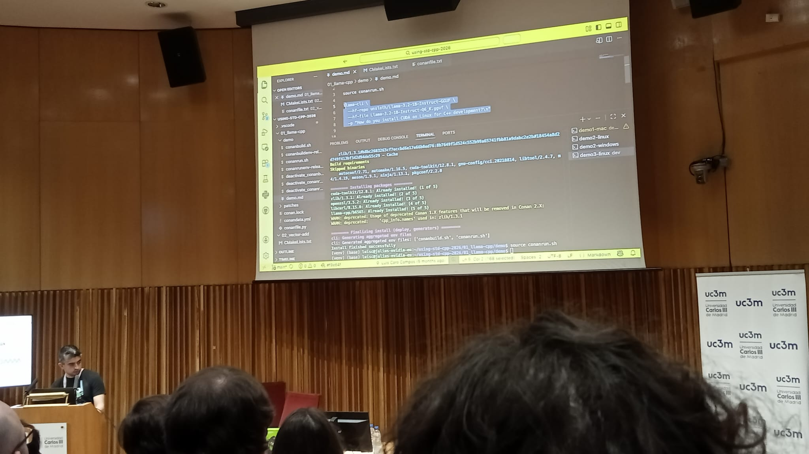
<figcaption>During the first half, they explained the tool by compiling
<a href="https://github.com/ggml-org/llama.cpp">llama.cpp</a> with CUDA support.</figcaption>
</figure>

Finally, the last one for me in this first day was given by José Gómez López, with a very self-descriptive title:
"Building a C++23 tool-chain for embedded systems". Professor Gómez's talk was a very practical walkthrough of what it 
takes to create a modern C++23 tool-chain tailored for a particular embedded target &ndash; the ESP8266 &ndash;. He 
explained the process of bootstrapping, the importance of lightweight runtime libraries, and performed some measurements
to showcase the performance of some C++23 features. There was a particular issue regarding modules, which in principle
were considerably slower than the rest, but it turns out that inlining was the major issue provoking this behavior.

<figure style="text-align: center;">
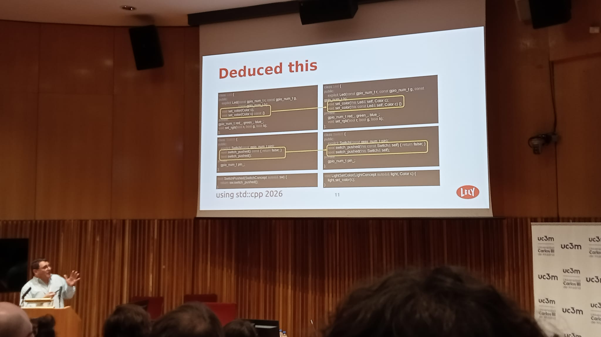
<figcaption>Employing deduced `this` in the test program, to test the capabilities and performance of the toolchain.
</figcaption>
</figure>

Overall, the impression this first day left on me was superb, it was really enjoyable, and thankfully there were two
more evenings.


# Second day

After this point in time, I was not able to hear the morning talks, again due to having class lectures at that same
period. I will then comment only on lectures that took place after 14:50.

<figure style="float: right; margin: 0.5rem 0 1rem 2rem; text-align: center; max-width: 30%;">
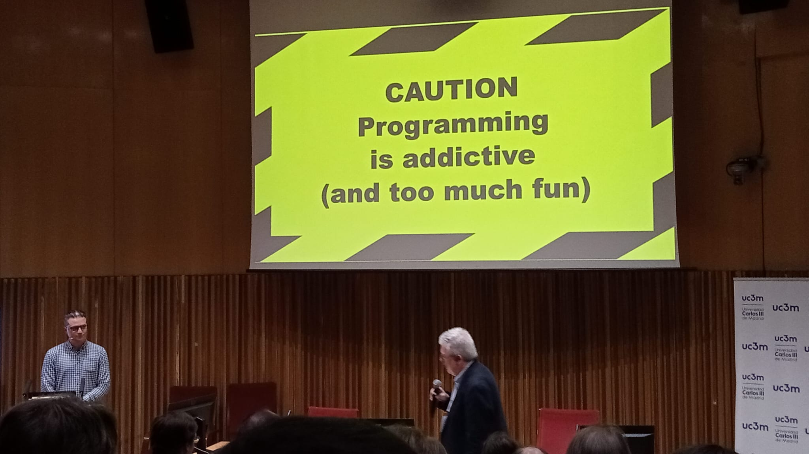
<figcaption>Funny screensaver displayed during the questions.</figcaption>
</figure>

Tuesday started for me with "Supercharge Your C++ Project: 10 Tips to Elevate from Repo to Professional Product", by Mateusz
Pusz, member of the ISO C++ committee, and creator of the [mp-units](https://github.com/mpusz/mp-units) library (on its way
to be part of the C++ standard library). I originally did not hold any expectations for it, since it was of a more
"social" rather than technical nature.

I must say, however, that it surprised me. He explained how adding `CONTRIBUTORS.md` and `README.md` files makes a great
improvement, and other details that are well known in general. The aspect in which he offered a new perspective which
especially amazed me was in managing CI. Whilst explaining how having passing CI is a crucial aspect, and ensuring that
code runs effectively in any platform to preserve the trust of customers, Pusz mentioned the obvious fact that running CI for
every possible combination of C++ toolchain, OS, and so forth, is virtually impossible because of time and money constraints,
in particular for an open source project such as his. The solution was to create a "build matrix", which is randomized on every
PR and can be easily replicated by introducing the seed number into GitHub Actions. Success is 99% ensured by testing each
checkbox at least twice a build; a very interesting take from my perspective. He then went on and explored the importance of
maintaining good relationship with contributors, and advocating for your own product.

<figure style="text-align: center;">
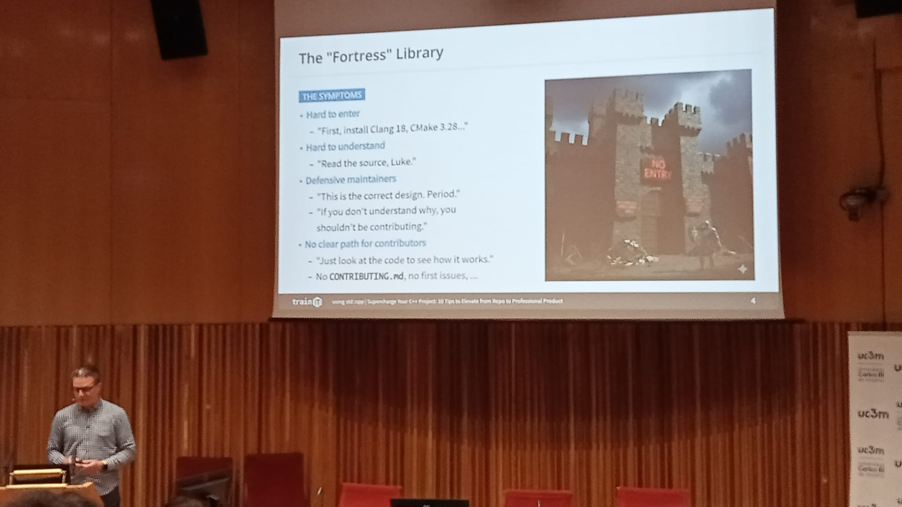
<figcaption>You do not want your library to feel like a fortress, but like a forum.</figcaption>
</figure>

Next came "Compiler as a Service: C++ Goes Live", with Aaron Jomy and Vipul Cariappa as speakers, which I found to be one of
the most brilliant talks I witnessed during the conference. It started by diving right into the code, showing how one can
make use of the LLVM Clang library to compile code just in time (JIT) and make a REPL for C++ by splitting the inputs into
Parallel Translation Units (PTU); they showed a live demo, and they mentioned a fact of which I was not aware, that Clang
already ships with a REPL! If you have this compiler installed, try executing `clang-repl`, or possibly `clang-repl-vv`, where
`vv` is your major version of your installation.

This was nothing but the very start, they proceeded to talk about how they integrated these features into Python in the
[CppInterOp](https://github.com/compiler-research/CppInterOp) library; [cppyy](https://github.com/wlav/cppyy) was also
mentioned for similar purposes. The motivation for this project came, as they explicitly mentioned, from their position at CERN,
where physicists are well known for being Python users.

But Python is mostly popular because of the interactivity it provides, it is because of tools such as Jupyter Notebook that
data scientists and the like can explore their data and do research without having to rebuild the entire executable (and deal
with CMake and similar). The last part elaborated precisely on this; project
[xeus-cpp](https://github.com/compiler-research/xeus-cpp) achieves this functionality, and one can indeed compile the C++ code
just in time into WebAssembly for interactive and rapid prototyping.
[Cling](https://github.com/root-project/cling) and [jank](https://jank-lang.org/) were also mentioned at the end.

<div class="twocols" style="display: flex; align-items: center;">
<figure style="text-align: center;">
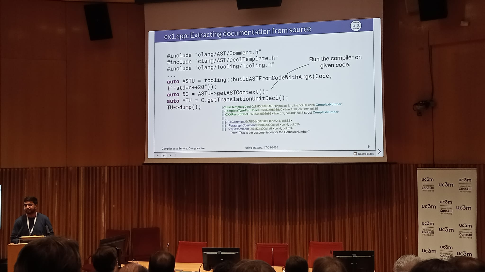
<figcaption>Demo of getting the AST of a C++ program to extract its documentation.</figcaption>
</figure>

<figure style="text-align: center;">
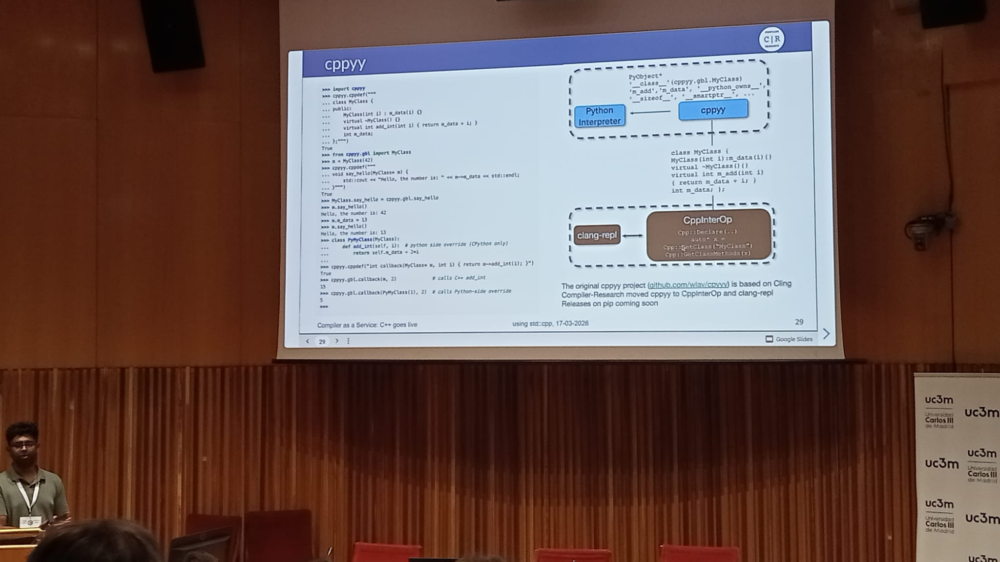
<figcaption>Overview of `cppyy`.</figcaption>
</figure>
</div>

Finally, I attended the last event I could for the day, and coming from such a high standard did not disappoint.
In "The CUDA C++ Developer's Toolbox", by Bernhard Manfred Gruber, the speaker gave an introduction to CUDA C++, and explained
the features of Thrust, libcu++, and cub, this by example.

The first program to implement was a simulation of the heat equation, in which three cups of water at different temperatures
were considered, and the task was to model their temperature across time and write their state at each time step into a file.
Gruber delved into `__host__` vs `__device__` (and both), the structure of GPU RAM, and how classes like `universal_vector<T>`
work, since memory is not shared between CPU and GPU; in fact, at the end of the session, most of the questions asked focused
on GPU memory internals, for instance it was discussed that CPU and GPU share the same address space, among other topics.

An example of such a program provided in the talk was one that took two vectors of integers, and computed the maximum element-wise
difference using `zip`-iterators and Thrust's reduce function with libcu++'s `cuda::maximum`. One of the snippets presented
should be representative enough:
```cuda
thrust::universal_vector<int> A(...);
thrust::universal_vector<int> B(...);

auto AB = thrust::make_zip_iterator(A.begin(), B.begin());

auto diffs = thrust::make_transform_iterator(
    AB.begin(),
    thrust::make_zip_function(
        [] __host__ __device__ (int a, int b)
        { return abs(a - b); }
    ));

auto max_diff = thrust::reduce(
    thrust::cuda::par,
    diffs, diffs + A.size(),
    0,
    cuda::maximum{});
```

Finally, topics such as the new `mdspan`, `transform`- and `zip`-iterators were discussed in what was a very insightful talk.

<figure style="text-align: center;">
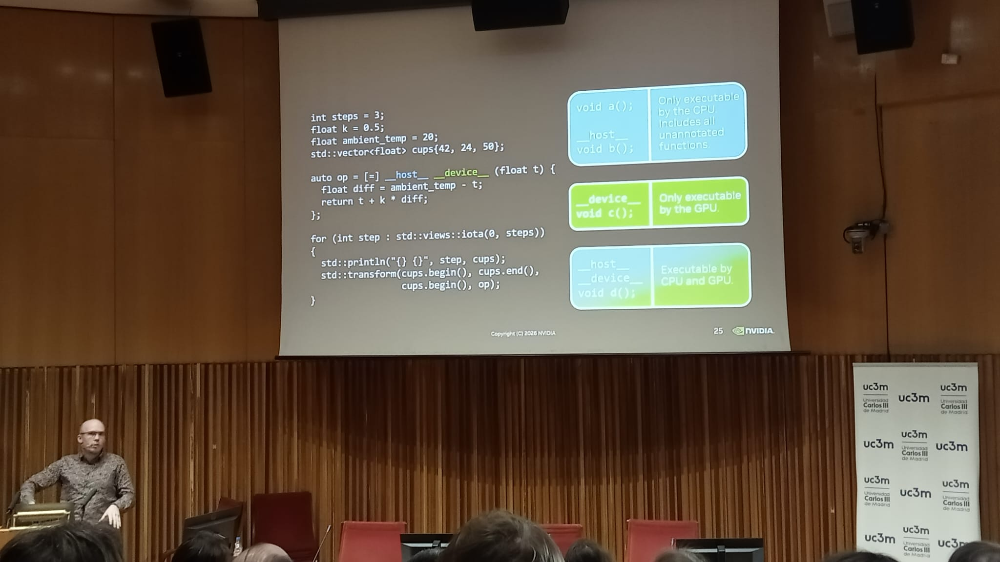
<figcaption>Difference between <code>__host__</code> and <code>__device__</code> functions.</figcaption>
</figure>

This second day was the one I enjoyed the most, and it had some of the best presentations to my taste.


# Third day

For the final stretch of the conference, my experience began with "You `throw`; I'll `try` to `catch` it", by Javier López Gómez,
compiler engineer and former PhD student at my university. This was a very interesting lecture, in which he delved into the
very, extremely low-level specifics of exception handling in C++.

A short, witty game of trivia then led to the exploration of the unwinding process; he explained various aspects of the Itanium ABI
(and mentioned MSVC's too), how Itanium generic and language-specific exceptions are modeled and handled, with their landing pads,
how the DWARF format is used for exceptions too, and not just for debugging purposes, and so forth. At the very end, he gave a
live demo in which he ran a C++ program that `throw`'d, with LLVM's libunwind compiled with debug symbols, and in which this stack
unwinding process could be seen at its crux.

The key takeaway, in terms of performance, is that exceptions are usually OK for exceptional behavior, no pun intended. I found
very interesting how virtual tables are notably compressed for the sake of performance (and how this makes them a very
sophisticated piece of engineering), and the Apple compact unwind format was a very clever idea as well. From my point of view
it was a very pleasing lecture, although some of the concepts were hard to comprehend for me. I wish I knew more to learn from
it to its full extent!

<figure style="text-align: center;">
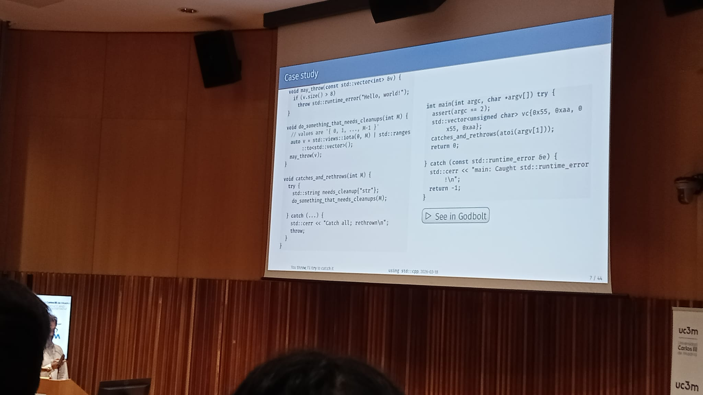
<figcaption>Simple C++ program to study exception handling.</figcaption>
</figure>

Next came "Squaring the Circle: value-oriented design in an object-oriented system", by Juan Pedro Bolívar Puente, and this time
there was no assembly at all; as the speaker said himself, "we were in the catacombs of C++, now we are going to be in the skies
of C++". It was indeed very high-level, mostly focused on design and with a lot of references to functional programming idioms
and even some very, very minimal category theoretical particularities.

In contrast to regular object-oriented programming, in the talk, the idea of values against objects was introduced at the
beginning; a value is an ethereal, immutable, and even platonic entity, whereas an object is completely the opposite, a mutable
instance which occupies a physical space in memory and lives as a tangible resource. 

The speaker made use of his own libraries for the sake of the demos, namely [lager](https://github.com/arximboldi/lager),
[immer](https://github.com/arximboldi/immer), and [zug](https://github.com/arximboldi/zug). In the end, he concluded with the
design of a to do app using Qt, which follows a notoriously legacy object-oriented paradigm, and reinvented the state structure
by using the so-called "single-atom" system. Finally, another concept that played a noteworthy role throughout the talk was the
Unidirectional Data-flow Architecture, which is heavily inspired by frameworks like Redux and languages like Elm.

<div class="twocols" style="display: flex; align-items: center;">
<figure style="text-align: center;">
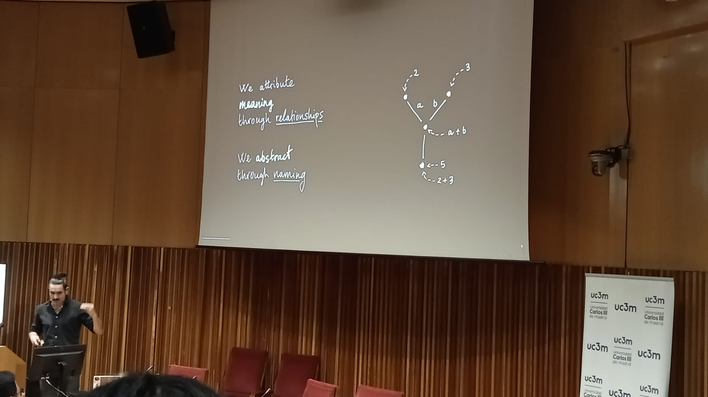
<figcaption>A common pattern in functional programming is to think of relations between the values.</figcaption>
</figure>

<figure style="text-align: center;">
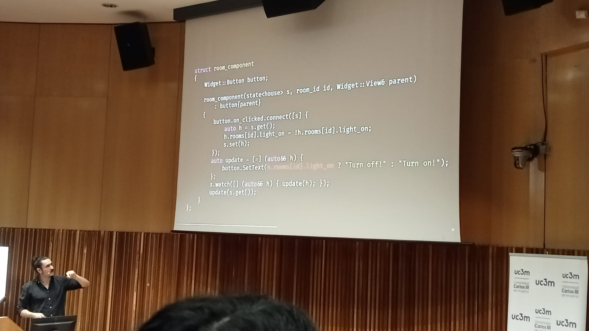
<figcaption>Example of modeling a house with some rooms and doors.</figcaption>
</figure>
</div>

And it was precisely about concepts that the closing talk of the conference was about. It was delivered by Professor Stroustrup,
especially known for being the creator of C++, i.e., the language the conference was devoted to. Generic programming is a
characteristic feature of the language, with the concept of templates being implemented for decades now, but it had been lacking
a crucial feature, which is imposing restrictions on the type parameters.

As an example, consider the following templated function, which takes an element of a type `T`, and returns the instance multiplied
by `1`:
```c++
template <typename T>
T id(T x)
{
    return x * 1;
}
```

Calling it as `id(1)` or `id(1.)` would indeed produce the desired behavior of returning the input argument unchanged, but passing
in a string, as `id("Hello"s)`, will provoke an error because the operator `*` does not have an instance matching an `std::string`
and an `int`; notice that such an error would report that this specific property failed, but nothing on the type itself. This is
where concepts fit, because the code above may be fixed by creating an `Id` concept, which ensures at compile time that the `* 1`
operation can be performed, and it would look as follows:
```c++
template <typename T>
concept Id = requires(T x) { x * 1; };

template <Id T>
T id(T x)
{
    return x * 1;
}
```

Now, if in `main` one called `id("Hello"s)`, this time the compiler would give the following message (GCC 15.2.0 on `x86_64-w64-mingw32`
on my machine), much more explanatory about where the problem comes from, and explicitly stating that only objects that can be
multiplied by `1` can be arguments of the function:
```
.\example.cpp: In function 'int main()':
.\example.cpp:10:13: error: no matching function for call to 'id(std::__cxx11::basic_string<char>)'
   10 |   cout << id("Hello"s) << endl;
      |           ~~^~~~~~~~~~
.\example.cpp:10:13: note: there is 1 candidate
.\example.cpp:7:19: note: candidate 1: 'template<class T>  requires  Id<T> T id(T)'
    7 | template <Id T> T id(T x) { return x * 1; }
      |                   ^~
.\example.cpp:7:19: note: template argument deduction/substitution failed:
.\example.cpp:7:19: note: constraints not satisfied
.\example.cpp: In substitution of 'template<class T>  requires  Id<T> T id(T) [with T = std::__cxx11::basic_string<char>]':
.\example.cpp:10:13:   required from here
   10 |   cout << id("Hello"s) << endl;
      |           ~~^~~~~~~~~~
.\example.cpp:5:9:   required for the satisfaction of 'Id<T>' [with T = std::__cxx11::basic_string<char, std::char_traits<char>, std::allocator<char> >]
.\example.cpp:5:14:   in requirements with 'T x' [with T = std::__cxx11::basic_string<char, std::char_traits<char>, std::allocator<char> >]
.\example.cpp:5:32: note: the required expression '(x * 1)' is invalid
    5 | concept Id = requires(T x) { x * 1; };
```

Nevertheless, this is barely the tip of the iceberg. Concepts are much more powerful and the talk focused on much more complicated
and elaborate examples; this is just a swift introduction to the topic.

<figure style="text-align: center;">
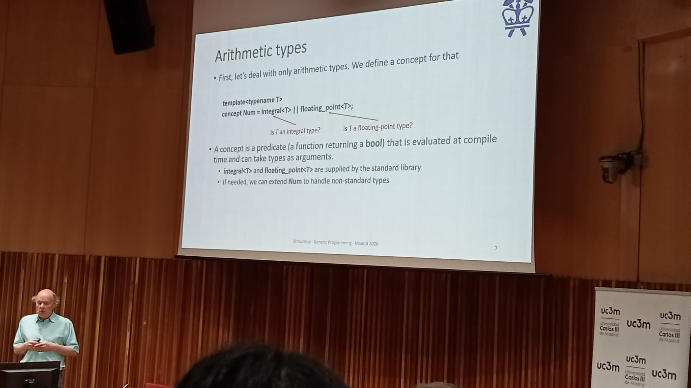
<figcaption>A concept for arithmetic types.</figcaption>
</figure>

How fast is this? According to Stroustrup, really fast. This is what C++ templates needed to become powerful, real metaprogramming,
and so it is an addition I truly like. And this concluded `using std::cpp` 2026!


# Conclusions

I have learned a lot during these few days on modern C++, it was very motivating to see many renowned names in the C++ community
share their knowledge. Take my words with a pinch of salt, however; I have tried to communicate what I have understood from each
of the talks I attended, but that does not imply that I do not make mistakes and that what I have written is completely accurate.
If you find any errata, please reach out to me.