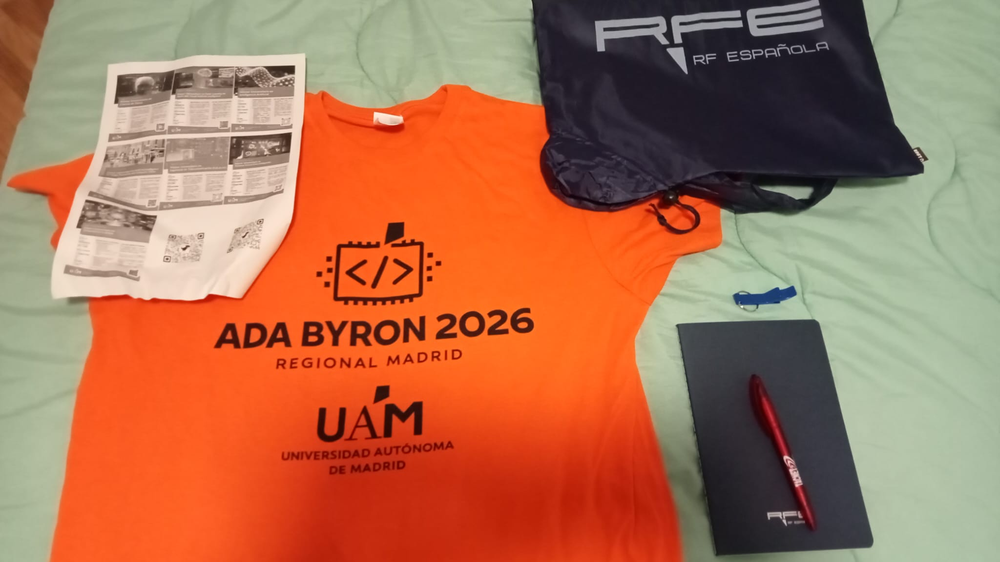
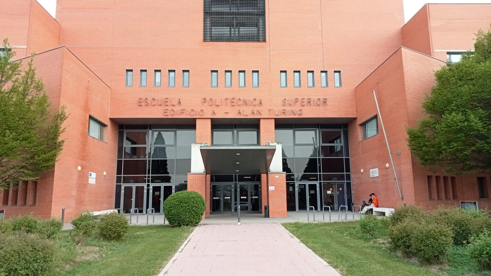
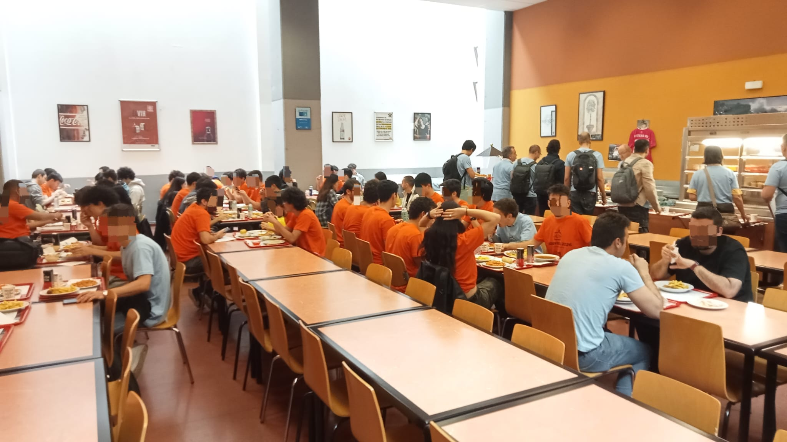
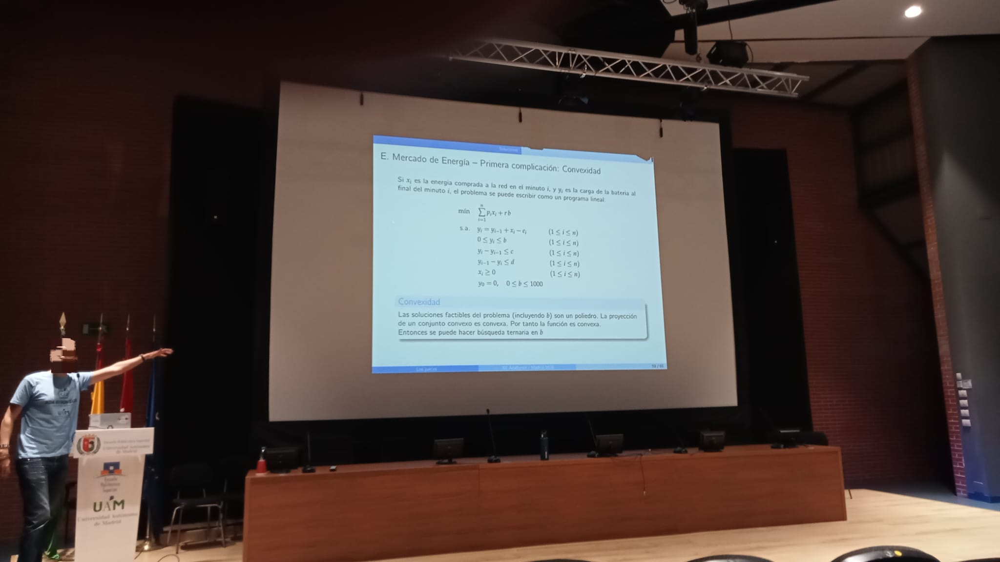

This weekend were the Madrid regionals of the Ada Byron contest, which, in a nutshell, is the Spanish collegiate olympiad of informatics. I signed up to this
event with my great friend and marvelous programmer [Kyryl Shyshko](https://github.com/kyryloshy) as the _Antibloatware Brigade_ &ndash; because the ELF 
executables of our solutions were mostly padding &ndash;, representing Universidad Carlos III de Madrid in category A (first year students).

The team was very excited about the competition; we had done some training previously via Codeforces and [¡Acepta el reto!](https://aceptaelreto.com/), but we 
were looking forward to participating in an event carried out in person. Overall, the final results were very good from our perspective, but I will go over 
them at the end of this article. For now, let's start from the very beginning.

# Registration

Friday the 10th, from 17:00 to 20:30 was the actual registration for the contest. Prior to that, the team had to sign up in a form provided by our university,
and they took care of the inscription; in contrast, teams from some other colleges had to participate in pre-selection contests before making their place into 
Ada Byron itself. This first day was relatively quick for us, since we only signed a few documents and got our t-shirts and some other "souvenirs", like a 
bag, a notepad, and a pen (thanks, Universidad Autónoma de Madrid!).

<figure style="text-align: center;">

<figcaption>The t-shirt we had to wear during the competition, along with some other gifts.</figcaption>
</figure>

Right afterward, however, we had to leave, since we had other matters to take care of, so we were not able to attend the talk and the training session 
mentioned in the program schedule. It was thus not until the next day that we would start solving problems.

# The problems

The day of the olympiad, we arrived at the _Escuela Politécnica Superior_ of Universidad Autónoma de Madrid at 9:00, and after reminding us of the rules and 
leaving our belongings in class 10, we proceeded to the computer laboratories to start coding.

<div class="twocols" style="display: flex; align-items: center;">
<figure style="text-align: center;">

<figcaption>Front side of the <em>Escuela Politécnica Superior</em>.</figcaption>
</figure>

<figure style="text-align: center;">

<figcaption>A photo of the campus of UAM.</figcaption>
</figure>
</div>

The computers took some time to boot up, but after 6 or 7 minutes our Ubuntu machine was ready to compile any C++ code we gave it. There was an envelope with
our names sitting on our table and containing the problem statements inside, which could only be opened at 9:30. At that moment, we started writing code and
problem A was done relatively quickly. It stated the following (after some paraphrasing and summarizing from my side):

<div class="problem">
Giving two strings $A, B$ composed of lowercase English characters, determine whether one can be transformed into the other by rearraging its letters and 
possibly removing a single one of them.
</div>

The solution is quite straightforward, since the constraint of being lowercase letters of the Latin alphabet restricts each character to 26 different 
possibilities, namely 'a' through 'z'. Hence, one can make an array of 26 integers containing the number of occurrences of each letter in $A$, and then 
iterate through $B$ subtracting one for each seen letter to, finally, return whether the number of entries different from 0 is less than or equal to 1. We did 
this exercise in Python, because we prioritized typing speed for the first problems, and it looked something like this:

```py
def main(a: str, b: str) -> bool:
    oc = [0] * 26
    for ai in a:
        oc[ord(ai) - ord("a")] += 1
    for bi in b:
        oc[ord(bi) - ord("a")] -= 1
    return sum(abs(i) for i in oc) <= 1


if __name__ == "__main__":
    for _ in range(int(input())):
        print("SI" if main(input(), input()) else "NO")
```

Regarding the constraints, $1 \leq |A|, |B| \leq 2\cdot 10^5,$ and we had two whole seconds to do the computations. Notice that we must traverse $A$ and $B$ at
least once, so any solution is $\Omega(2n)$, where $n = \min\\{|A|, |B|\\}$, and likewise our program is $\mathscr O(|A| + |B|)$, so for the worst possible 
input, in which $|A|\sim |B| = 2\cdot 10^5$, our algorithm is indeed $\Theta(2n)$ and thus optimal; as a result, it was evidently fine, a quick warm-up. 

We found problem B to be considerably harder and, in the end, we could not solve it. We tried C for a long time, however, which essentially asked to maintain
a list of booleans which was to be updated upon some special queries, and to print the $n$th first false value after another special query. I cannot emphasize
enough that I _knew_ that this problem was solved using a Fenwick tree, because they are standard when dealing with range queries, but alas, we did not 
remember how to implement Fenwick trees in C++, so we could not finish it.

And that is another important point I have not mentioned yet; we were allowed to bring a so-called "dossier" (a cheat sheet, essentially) containing fragments
of useful code, but since we were told that information a single day in advance, we ended up not bringing anything. To be fair, it is mostly my fault, since 
it was stated in the rules, but they were long and boring, so I assumed nothing special would be there and ended up skimming through them. This will be 
important when we talk about problem L, though.

At this point we were slightly frustrated, since we had only figured out problem A and the clock was ticking, but after looking at the scoreboard and seeing 
that many teams had solved F, we decided to give it a try, which was a good decision. It asked for the following (again, after summarizing to a big extent):

<div class="problem">
Given two integers $N, K$ with $1 \leq N \leq 2\cdot 10^5$ and $1 \leq K \leq 10^5$, you must maintain a list of at most $K$ elements on which two types of 
operations can be performed a total of $N$ times:
<ol>
    <li><code>1 P</code>: Try to add the value $P$ to the list. If the list is full and the smallest number is larger than $P$, do not include it.</li>
    <li><code>2 X</code>: Increase the smallest number in the list by $X$.</li>
</ol>
Your task is to print the sum of all the elements of the list after all the operations have been performed.
</div>

These kinds of problems where updating a sorted list is the crucial part call for priority queues (i.e., heaps), since this is the sort of tasks they were 
built to solve. Thus, our C++ solution looked something like the following:
```cpp
#include <bits/stdc++.h>
#define endl '\n'

using namespace std;
using uint = unsigned int;
using ull = unsigned long long;
using ll = long long;

int main()
{
    ios::sync_with_stdio(false);
    cin.tie(nullptr);

    uint n, k, c = 0;
    ll s = 0, t, x;
    priority_queue<ll> ls;

    for (cin >> n >> k; n--;)
    {
        cin >> t >> x;

        if (t == 1)
        {
            if (c < k)
            {
                ls.push(-x);
                s += x;
                c++;
            }
            else if (c == k && x > -ls.top())
            {
                s += x + ls.top();
                ls.pop();
                ls.push(-x);
            }
        }
        else
        {
            t = ls.top();
            ls.pop();
            ls.push(t - x);
            s += x;
        }
    }

    cout << s << endl;

    return 0;
}
```

The exact code we used is probably lost for the good, but this is a very good approximation of what we did. Notice that pushing and popping is
$\mathscr O(\log n)$, whereas `ls.top()` is $\mathscr O(1)$, so this algorithm has a time complexity of $\mathscr O (N \log K)$, which was accepted by the 
judge so it should be close to being optimal.

We then saw that H was very popular as well, so we decided to tackle that one next. It looked like this:

<div class="problem">
An integer $N$ is said to be <em>interesting</em> if it is a palindrome, divisible by $1234$, or divisible by $4321$. Given $1 \leq N \leq 10^6$, if it is 
interesting print <code>INTERESANTE</code>, otherwise print the difference between $N$ and the smallest interesting number greater than $N$.
</div>

A crucial point here is the input size, because it is quite small; the time limit is also generous, giving us again two seconds. Because the interesting
numbers are very few, we can write a Python script ahead of time that generates them all, which would look something like this:
```py
print([i for i in range(1, 1_000_002) if i % 1234 == 0 or i % 4321 == 0 or str(i) == str(i)[::-1]])
```

Then, we can hard-code these numbers (they are only 3038) into our code, and a simple linear search does the trick. The final program looked like this:
```cpp
#include <bits/stdc++.h>
#define endl '\n'

using namespace std;
using uint = unsigned int;
using ull = unsigned long long;
using ll = long long;

static uint ns[] = {...}; // the hard-coded numbers go here

int main()
{
    ios::sync_with_stdio(false);
    cin.tie(nullptr);

    uint t, n;

    for (cin >> t; t--;)
    {
        cin >> n;

        for (uint k : ns)
        {
            if (k == n)
            {
                cout << "INTERESANTE" << endl;
                break;
            }
            if (k > n)
            {
                cout << k - n << endl;
                break;
            }
        }
    }

    return 0;
}
```

In fact, we had to ask the judge, because the source file was a whole 14 KiB in size, but it turned out to be fine, and this ended up being our third solution.

Finally, L caught our attention for being very math-heavy. All the problems, by the way, were highly contextualized, but after stripping all that unnecessary
information what was being asked looked something along the lines of the following:

<div class="problem">
Given numbers $1 \leq a, b \leq N \leq 10^{12}$, enumerate all the solutions to the following equation:
$$
    ax + by = N,\qquad x, y \in \mathbf Z_{\geq 0}.
$$
</div>

This is a textbook linear Diophantine equation! Recall that to solve them we need a solution $(x_0, y_0)$ to
$$
    a x + b y = d,\qquad (d = \gcd(a, b))
$$
which is given by the extended Euclidean algorithm, and then all the pairs of integer solutions $(x, y)$ are given by
$$
    x = \frac{Nx_0}{d} - \frac{b}{d} \lambda,\qquad y = \frac{Ny_0}{d} + \frac{a}{d}\lambda,\qquad \lambda \in \mathbf Z.
$$

We want $x,y \geq 0$, so
<div>
$$
\begin{cases}
    \displaystyle \frac{Nx_0}{d} - \frac{b}{d} \lambda &\geq 0 \implies \displaystyle \lambda \leq \frac{Nx_0}{b}\\\\
    \displaystyle \frac{Ny_0}{d} + \frac{a}{d} \lambda &\geq 0 \implies \displaystyle \lambda \geq -\frac{Ny_0}{a}
\end{cases} \implies \left\lceil-\frac{Ny_0}{a}\right\rceil \leq \lambda \leq \left\lfloor\frac{Nx_0}{b}\right\rfloor;
$$
</div>

and therefore we have a range through which iterate with $\lambda$ which guarantees positive solutions, and that is exactly the way we proceeded. The problem,
however, is that we had to write the extended Euclidean algorithm ourselves, but this was mostly time-consuming and we were eventually able to figure it out. 
We first remembered was the fact that $\gcd(a, b) = \gcd(a, b \operatorname{mod} a)$ which, because this is my blog, we are going to prove:

<div class="theorem">
    Given $a, b \in \mathbf Z$, then $\gcd(a, b) = \gcd(a, b \operatorname{mod} a)$.
</div>
<div class="proof">
    Let $d = \gcd(a, b)$ and notice that
    $$
        d \mid b \implies d \mid aq + (b \operatorname{mod} a) \implies d \mid b \operatorname{mod} a.
    $$
    Since $\gcd(a, b \operatorname{mod} a) \leq d$ and the LHS is maximal by definition, the equality is trivial.
</div>

From this, only computing the GCD is straightforward:
```cpp
uint gcd(uint a, uint b)
{
    if (a == 0) return b;
    if (b == 0) return a;

    if (a > b)
    {
        int aux = a;
        a = b;
        b = aux;
    }

    return gcd(a, b % a);
}
```

But we also want the Bézout coefficients $x_0, y_0$ that satisfy $ax_0 + by_0 = d$. Because of the theorem above, there exist $x_0', y_0'$ such that
$$
    a x_0' + m y_0' = d,
$$
where $m = a \operatorname{mod} b$; they can be calculated recursively, and hence
$$
    d = ax_0 + by_0 = ax_0 + (aq + m)y_0 = a(x_0 + qy_0) + my_0 \implies \begin{cases}
        x_0 = x_0' - qy_0',\\\\
        y_0 = y_0'.
    \end{cases}
$$
With the recursive step figured out, we can finally put everything together in code as follows:
```cpp
ll euclid(ll a, ll b, ll &x, ll &y)
{
    if (a == 0)
    {
        x = 0;
        y = 1;
        return b;
    }
    if (b == 0)
    {
        x = 1;
        y = 0;
        return a;
    }

    ll d;

    if (a > b)
    {
        d = euclid(a % b, b, x, y);
        y -= a * x / b;
    }
    else
    {
        d = euclid(a, b % a, x, y);
        x -= b * y / a;
    }

    return d;
}
```

Initially we had no pen nor sheet of paper, but a member of the staff named Lucía kindly lent us one; without it, we could not have derived the results above 
and hence not solved problem L. If you are reading this, thank you, Lucía!

Finally, we spent the rest of the time solving problem D, and we actually finished it, but a minute late when submitting the problem, so in the end we could 
not submit that one. It was a pathfinding problem using breadth-first search, but it was relatively long to write, especially because of checking the 
boundaries and updating the priority queue with the current distances.

And with this, 5 whole hours had passed, and the coding part was done; time does fly when you are in the middle of something.

# Results and conclusions

After the competition the organizers fed us lunch, and we had an hour-long lecture with the solutions to the problems.

<div class="twocols" style="display: flex; align-items: center;">
<figure style="text-align: center;">

<figcaption>The cafeteria of the EPS.</figcaption>
</figure>

<figure style="text-align: center;">

<figcaption>Solution to problem E.</figcaption>
</figure>
</div>

Then, the scoreboard was unfrozen (with ICPC rules, it freezes at the last hour of the competition to add some excitement) and the final results were
given. We finished 16th out of 40, and second in category A. It is such a pity that we could not finish D, but that should motivate us to keep training towards
the next contests.

Without nothing else to say, we congratulate to the winners of each category, and thank the organizers and our university for giving us the opportunity to
participate.