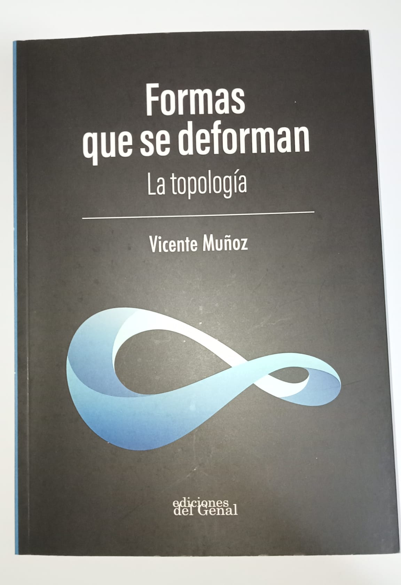
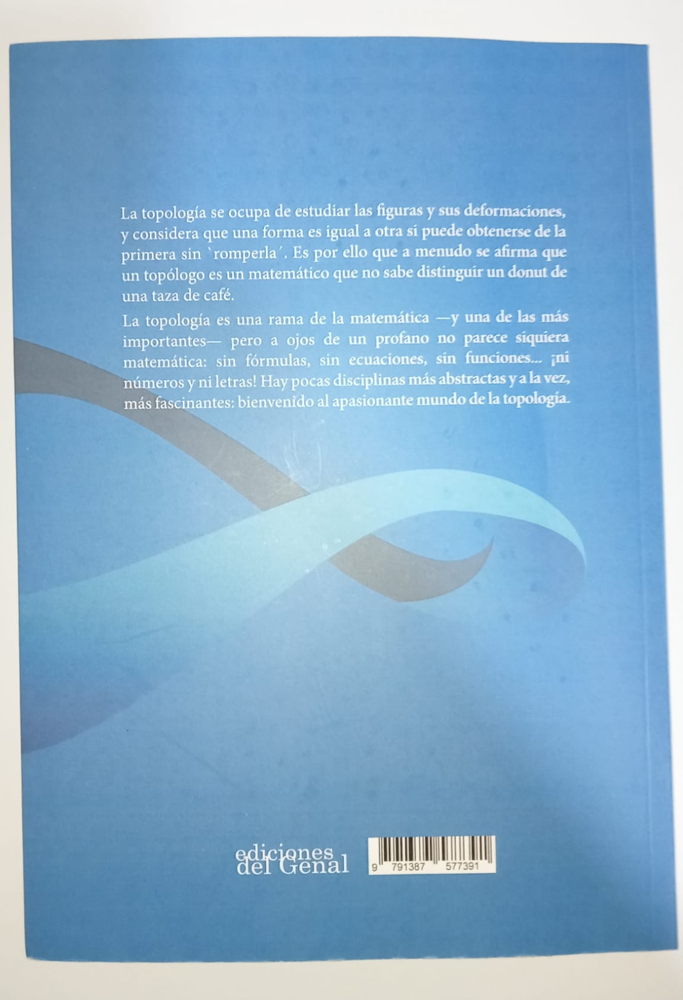

<figure class="wrap-right" style="max-width: 15%;">

<figcaption>Portada de <em>Formas que se deforman</em>.</figcaption>
</figure>

Hace poco más de un mes, el matemático y divulgador Miguel Ángel Morales Medina
(autor del reconocido blog [_Gaussianos_](https://www.gaussianos.com/) y gran
colaborador en el grupo de Telegram [_Retos Matemáticos_](https://t.me/Retos_Matematicos))
[organizó el sorteo](https://x.com/gaussianos/status/2046658221834654018) de un
ejemplar de _Formas que se deforman: la topología_, cedido por su autor Vicente
Muñoz Velázquez (catedrático de Geometría y Topología en la Universidad
Complutense de Madrid) con motivo de la celebración del día del libro. Yo
participé con la misma actitud con la que juego la lotería: con ilusión, pero
asumiendo de antemano que ganar era altamente improbable; no obstante, fue
grata mi sorpresa cuando me comentaron que
[había sido elegido](https://x.com/gaussianos/status/2062503841136886155), y
aún mayor cuando por fin tuve el libro entre mis manos. Tras varios días de
lectura, he organizado mis pensamientos sobre la obra, y la compilación de
estos es el breve texto que sigue a continuación.

No obstante, antes de proceder es imperativo resaltar que en el momento en el
que publico esta reseña **no tengo conocimientos formales sobre topología**,
por lo que el lector debería tomar mis opiniones _cum grano salis_; además, el
lector ha de saber que partes fundamentales de la narrativa se mencionan
explícitamente, y si bien este hecho en un libro de matemáticas no suele ser
demasiado relevante, aquel que únicamente quiera escuchar mi veredicto puede
saltar a las [conclusiones finales](#conclusiones). Por último, quisiera
aprovechar la ocasión para agradecer a Miguel Ángel y al autor la oportunidad
de acceder a tan sucinta introducción a esta rama.

# La cosmología como reclamo

Un vistazo a la plétora de libros sobre divulgación física en el mercado (así
como a la popularidad de los vídeos de YouTube con este mismo propósito)
demuestra que existe un gran interés del público general por esta disciplina,
en particular por aquellas cuestiones que rozan la metafísica al tratar
aspectos fundamentales como la creación del Universo o su forma.

El autor emplea la última de las incógnitas anteriores como gancho y ejemplo
motivante de cara al estudio matemático de la topología, lo que desde mi
perspectiva es una decisión acertada, a pesar de que quizás un acercamiento
histórico hubiese satisfecho mejor mis intereses personales.

Me gustaría remarcar que sí que se ahonda en este tema, a pesar de no ser el
centro del texto evidentemente, incluyendo un breve vistazo a la relatividad
general de Einstein en el final, así como un estudio más o menos exhaustivo
sobre la curvatura del Universo, las consecuencias del signo de este valor, y
los experimentos que se han llevado a cabo para su medición.

# Planilandia como hilo conductor

Cuando uno se enfrenta a un problema de considerable dificultad, una estrategia
común (que también se menciona aquí), es reducirlo a un caso particular más
manejable para obtener ideas que más adelante puedan ser extrapolables al
problema real.

La historia contiene la subtrama de _Planilandia_, un mundo constituido por
seres bidimensionales (polígonos, en particular) con las mismas inquietudes que
la raza humana, los cuales sí logran descubrir cuál es la forma del universo en
el que habitan. Ciertamente se siente como un viaje en el que acompañar a los
_planilandeses_ mientras uno estudia las 2-variedades antes de atacar la
cuestión que verdaderamente nos incumbe, pero tras concluir nos sirven de
inspiración y nos llenan de motivación. Al fin y al cabo, si Rombete y compañía
pudieron desentrañar su universo empleando para ello solo la razón, ¿por qué
nosotros no podríamos?

Lo que hace a Planilandia memorable es que se siente como un viaje genuino. En
parte porque su historia se extiene a lo largo de más de la mitad del libro,
pero en parte también porque aunque casi no se emplean ecuaciones a lo largo
del texto, el razonamiento que se sigue es enteramente deductivo (salvo cuando
algún resultado posee una demostración demasiado compleja y llena de matices
que no puede ser simplificada para el lector inexperto); uno no está viendo a
los planilandeses solamente, está aprendiendo con ellos.

# No hace falta rigor para divulgar

El autor recurre muy pocas veces a las fórmulas simbólicas, excluyendo la
característica de Euler y teorema de Gauss-Bonnet en una forma
considerablemente simplificada, y es que en ocasiones los teoremas
fundamentales de algunas ramas de las matemáticas son conocimientos de
naturaleza tan abstracta que pueden entenderse conceptualmente a costa de dejar
a un lado los formalismos, perdiendo rigor, eso sí.

Pero pienso que el propósito de un divulgador es ese, el de destilar los
resultados envueltos en notación y especificidades para obtener su esencia,
aquella idea feliz que cambia la forma de pensar de quien logra comprenderlos.

Algo parecido puede verse en el capítulo 3, pues su cénit es el teorema de
clasificación de superficies. Es en este momento que uno aprecia cómo se cierra
una teoría, cómo una investigación que se ha ido desarrollando poco a poco
junto al lector (aún con sus simplificacines, recordemos que este es un libro
divulgativo) acaba concluyendo en un razonamiento fundamental a un nivel
superior, etéreo incluso, que sin embargo no es en absoluto trivial. Por
momentos como ese pienso que las matemáticas son la única ciencia sintética
_a priori_, ya que cualquier otra precisa de la observación para llegar a estas
conclusiones.

Y precisamente resalto este como el momento álgido del libro, a pesar de ser
anterior al meridiano, por la sensación que provoca. Recuerdo hace algunos años
una experiencia similar en _Introduction to Graph Theory_, de Richard J.
Trudeau, al derivar el teorema de Kuratowski para resolver finalmente el
problema de la planicidad en grafos (otro libro ciertamente notable).

# Lo no tan bueno

Son pocas las objeciones que puedo hacer, y se remiten principalmente a
pequeños detalles que tienen medida nula en comparación a las continuas bazas
que ya se han comentado.

En primer lugar hacer mención de un detalle sin demasiada relevancia, que las
ilustraciones que no son propias del libro (asumo que archivos JPG obtenidos de
otras fuentes) han sido incluidas con una calidad bastante mala, que debería
ser revisada de cara a una futura edición. Afortunadamente son pocas y no
cumplen un rol esencial en las explicaciones; el material original elaborado
por el autor no sufre de estas asperezas.

Seguidamente, su precio también puede ser un detractor, puesto que aunque no es
prohibitivo, bien es cierto que dada su extensión y el hecho de estar en blanco
y negro a mi parecer debería colocarlo en el umbral de los 10-15€, mientras que
al momento de la publicación de este artículo puede adquirirse por 18€ en
[el sitio web de la editorial](https://www.edicionesdelgenal.es/libro/ver/4110482-formas-que-se-deforman.html).

Su longitud es quizás otro inconveniente; 170 páginas se me han hecho cortas,
y es que hubiese disfrutado de un poco más de esta prosa, aunque esto se debe
también a que la calidad de la misma es excelente.

# Conclusiones

<figure class="wrap-left" style="max-width: 15%;">

<figcaption>Parte trasera de mi ejemplar.</figcaption>
</figure>

En definitiva, dicho todo lo anterior, pienso que el libro es muy recomendable
para quien se lo pueda permitir. Uno ha de asumirlo con la mentalidad de que es
de naturaleza divulgativa, en el que no verá formalismos ni el formato
teorema/demostración al que acostumbran los libros de texto al uso, pero creo
que hasta quienes no tienen una profesión técnica pueden disfrutar de este
texto por la claridad con la que se presentan los conceptos. Eso sí, para estos
últimos (y para el resto, dicho sea) sobra mencionar que como toda lectura
sobre matemáticas, de vez en cuando hay que pararse a pensar.